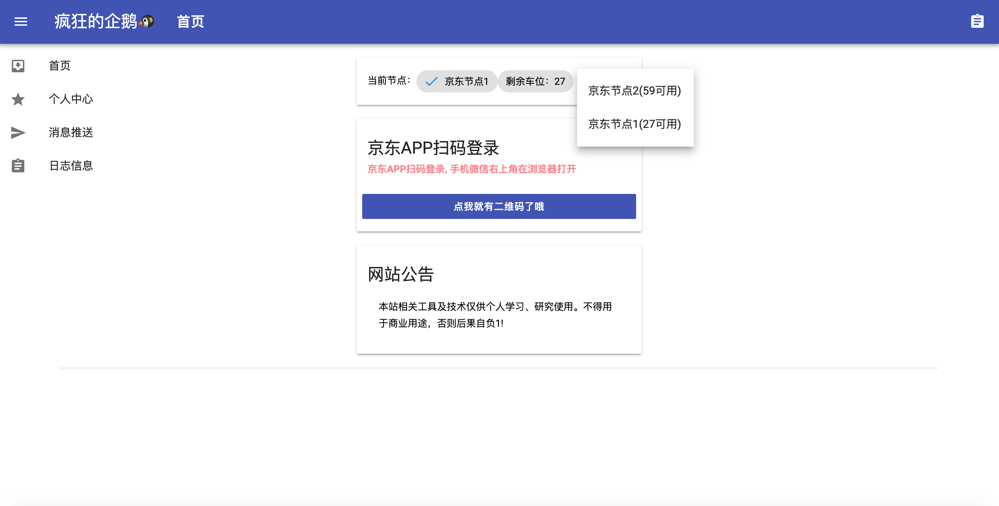

# qinglong-jdc-mulit-node
青龙2.8&amp;JDC多节点集成环境

# 配置节点连接
进入pubic目录 修改config.js节点url
```script
let publicnodeinfo = [
	{ "name":"京东节点1", "url":"http://node1:3002" },
	{ "name":"京东节点2", "url":"http://node2:3003" }
]
```
# 启动容器
```shell
$ docker-compose up &
```


# 停止容器
```shell
$ docker-compose down
```

